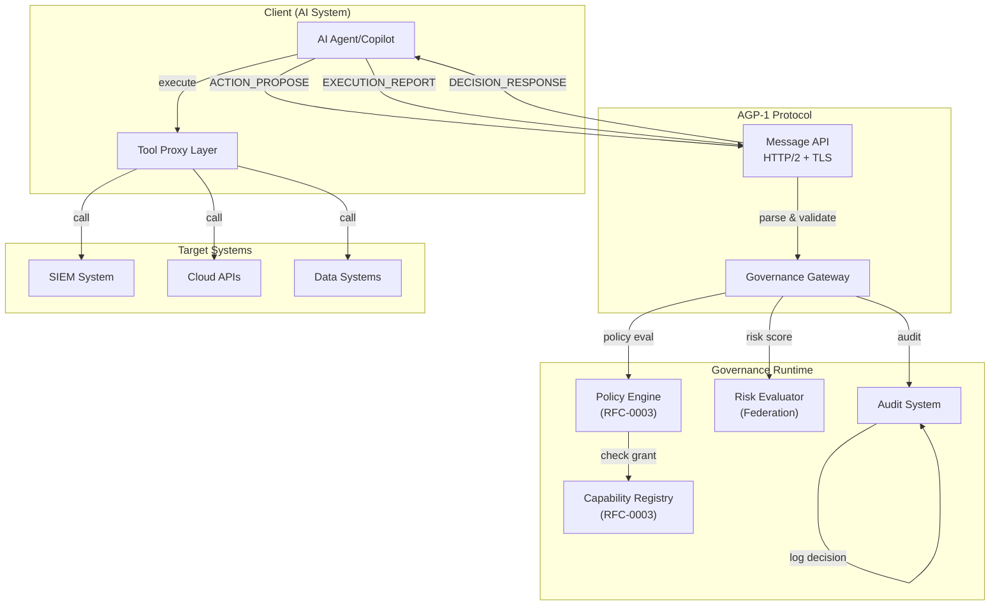

# AEGIS™ AGP-1 Protocol Overview & Design Principles

**Document**: AGP-1/Overview (AEGIS_AGP1_OVERVIEW.md)  
**Version**: 1.0 (Normative)  
**Part of**: AEGIS Governance Protocol  
**Last Updated**: March 6, 2026

---

## Purpose

The AEGIS™ Governance Protocol (AGP-1) defines the **request-response contract** between:

- **Clients**: AI-based systems, autonomous agents, copilots, orchestration platforms
- **Servers**: AEGIS governance runtimes, policy enforcement engines, decision systems

Every operational action proposal passes through this protocol, receiving a deterministic decision:

- **ALLOW**: Action permitted (possibly with constraints)
- **DENY**: Action forbidden  
- **ESCALATE**: Requires human review
- **REQUIRE_CONFIRMATION**: Requires explicit user consent

---

## Core Design Principles

### 1. Deterministic Governance

**Principle**: Identical requests + identical policies = identical decision

This ensures:

- Predictable behavior for compliance and auditors
- Reproducibility for incident forensics
- No hidden or inconsistent decision paths

**Implementation**:

- Policy language is unambiguous (context-free grammar)
- Risk scoring uses deterministic algorithms (no randomness)
- Decision logic is explicit (not learned models)
- Audit trail captures exact computation path

### 2. Default-Deny

**Principle**: Absence of explicit authorization yields denial

This ensures:

- Accidental misconfiguration doesn't grant access
- Unknown actions are blocked (fail-closed)
- Security posture improves over time (additive rules only)

**Implementation**:

- Capability MUST be explicitly registered
- Actor MUST have explicit grant for capability
- Policy MUST explicitly match to permit
- Risk MUST be within acceptable threshold

### 3. Complete Attribution

**Principle**: Every request includes authenticated actor identity[^17]

This enables:

- Clear accountability for all actions
- Audit trail linking decisions to actors
- Tracing of coordinated or anomalous behavior

**Implementation**:

- All messages include `actor_id` and authentication credentials
- Actor_id MUST match authentication token subject
- Actor type indicates human, AI system, or automation
- Signatures or mutual TLS proves identity

### 4. Immutable Audit

**Principle**: Every decision is persisted permanently and cannot be modified

This ensures:

- Compliance with regulatory requirements (SOX, HIPAA, etc.)
- Evidence for incident investigation
- Detection of tampering or unauthorized changes

**Implementation**:

- All decisions written to append-only log
- Hash chain prevents modification of older entries
- Audit log backed up to immutable storage
- Deletion requires explicit governance approval

### 5. Fail-Closed Semantics

**Principle**: All subsystem failures result in denial or escalation, never implicit allow

This prevents:

- Outages from accidentally granting access
- Misconfiguration from going undetected
- Degraded systems from making dangerous decisions

**Implementation**:

- Missing capabilities treated as denial (not found = not granted)
- Unavailable policy engines escalate (don't allow)
- Timeout triggers denial (rather than retry-until-success)
- Audit storage failure prevents decision (not logged = not approved)

---

## Message Categories

AGP-1 defines **6 message types** for complete governance:

### Request Messages (Client → Server)

| Message | Purpose | Use Case |
|---------|---------|----------|
| **ACTION_PROPOSE** | Client proposes an action for evaluation | Before executing tool calls, system commands, data access |
| **EXECUTION_REPORT** | Client reports what actually happened | After action execution (success, failure, timeout, resources used) |
| **ESCAL_ATION_RESPONSE** | Client responds to escalation request | Human reviewed and approved/denied |
| **AUDIT_QUERY** | Client queries audit trail | Compliance forensics, incident investigation |

### Response Messages (Server → Client)

| Message | Purpose | Use Case |
|---------|---------|----------|
| **DECISION_RESPONSE** | Server returns decision for proposed action | Tells client: ALLOW, DENY, ESCALATE, REQUIRE_CONFIRMATION |
| **ESCALATION_REQUEST** | Server requests human review | When risk/uncertainty too high for autonomous decision |
| **HEALTH_CHECK_RESPONSE** | Server confirms protocol health | Periodic monitoring, version negotiation |

---

## Protocol Lifecycle[^3]

```
┌─────────────────────────────────────────────────────────────────┐
│ 1. CLIENT PROPOSES ACTION                                       │
│    - Sends ACTION_PROPOSE with:                                 │
│      * capability, target, parameters, context                 │
│      * actor identity + authentication                          │
├─────────────────────────────────────────────────────────────────┤
│ 2. SERVER EVALUATES                                             │
│    - Validates schema and actor identity                        │
│    - Resolves capability from registry                          │
│    - Evaluates policies (deterministic)                         │
│    - Computes risk score (5 factors)                            │
├─────────────────────────────────────────────────────────────────┤
│ 3a. DECISION: ALLOW / ESCALATE / DENY                          │
│    - If ALLOW: returns DECISION_RESPONSE with constraints      │
│    - If ESCALATE: sends ESCALATION_REQUEST to client           │
│    - If DENY: returns DECISION_RESPONSE (no constraints)        │
├─────────────────────────────────────────────────────────────────┤
│ 3b. IF ESCALATE: HUMAN REVIEW                                  │
│    - Human operator reviews evidence                            │
│    - Approves or denies action                                  │
│    - Sends ESCALATION_RESPONSE back to server                   │
├─────────────────────────────────────────────────────────────────┤
│ 4. CLIENT EXECUTES (if ALLOW)                                  │
│    - Calls target system (SIEM, cloud API, etc.)               │
│    - Applies constraints from decision (timeout, max_results)  │
├─────────────────────────────────────────────────────────────────┤
│ 5. CLIENT REPORTS OUTCOME                                       │
│    - Sends EXECUTION_REPORT with:                              │
│      * status (completed, failed, timeout, denied)             │
│      * exit code, duration, resource usage                     │
├─────────────────────────────────────────────────────────────────┤
│ 6. SERVER AUDITS & COMPLETES                                    │
│    - Records execution outcome in audit log                    │
│    - Updates telemetry and metrics                             │
│    - Propagates signals to federation (if configured)          │
└─────────────────────────────────────────────────────────────────┘
```

---

## Integration with AEGIS Architecture

AGP-1 sits at the heart of AEGIS governance:



---

## Decision Confidence Spectrum

Decisions exist on a spectrum from high-confidence to low-confidence:

| Confidence | Characteristics | Decision |
|------------|-----------------|----------|
| **0.99+** | Explicit policy match, low risk, trusted actor, known pattern | ALLOW (immediate) |
| **0.8-0.99** | Good policy match, moderate risk, standard monitoring | ALLOW (with enhanced logging) |
| **0.5-0.8** | Ambiguous policy or elevated risk or novel pattern | ESCALATE (human review) |
| **< 0.5** | Contradictory signals, critical risk, unauthenticated | DENY (no constraints) |

---

## Key Design Decisions

### Why Non-Interactive Messages?

AGP-1 uses **asynchronous, non-interactive** request-response pattern:

- ✅ Scales better (client waits for response, no long-lived connections)
- ✅ Cleaner error handling (each message includes all context)
- ✅ Works across trust boundaries (complete message = attestable decision)
- ✅ Supports distributed deployment (no session state)

### Why Deterministic Evaluation?

AGP-1 requires **deterministic policies**, not learned models:

- ✅ Auditable: can reproduce decision for compliance
- ✅ Debuggable: can trace exact path through policy
- ✅ Predictable: no surprises or inconsistencies
- ✅ Reversible: can explain why decision made

ML models can inform *risk scoring* but not final decision.

### Why Risk Scoring?

AGP-1 combines **policy evaluation + risk scoring**:

- Policy answers: "Is this capability granted?"
- Risk answers: "Is this action safe right now?"

Both must pass for ALLOW decision.

### Why Human Escalation?

AGP-1 includes **escalation for human review** because:

- ✅ Handles novel situations beyond policies
- ✅ Provides oversight for high-stakes decisions
- ✅ Builds operator confidence in system
- ✅ Creates feedback loop: escalations → new policies

---

## Limitations & Out of Scope

AGP-1 does **NOT** address:

- End-to-end encryption for message payload (handled by TLS)
- Fine-grained field-level access control (handled by policies)
- Distributed consensus across multiple nodes (future: AGP-2)
- GraphQL or REST API wrappers (handled by RFC-0002)

---

## Next Steps

Continue reading:

1. **[AEGIS_AGP1_MESSAGES.md](./AEGIS_AGP1_MESSAGES.md)** - Exact message schemas and field specifications
2. **[AEGIS_AGP1_AUTHENTICATION.md](./AEGIS_AGP1_AUTHENTICATION.md)** - How to authenticate as a client
3. **[AGP1_Flows.md](./AGP1_Flows.md)** - Visual protocol flows and state machines

---

## References

[^3]: S. Hallé and R. Villemaire, "Runtime Enforcement of Web Service Message Contracts with Data," *IEEE Transactions on Services Computing*, vol. 5, no. 2, pp. 192–206, April–June 2012, doi: 10.1109/TSC.2011.10. See [REFERENCES.md](../../REFERENCES.md).

[^17]: S. Rose, O. Borchert, S. Mitchell, and S. Connelly, "Zero Trust Architecture," National Institute of Standards and Technology, Gaithersburg, MD, NIST Special Publication 800-207, Aug. 2020, doi: 10.6028/NIST.SP.800-207. See [REFERENCES.md](../../REFERENCES.md).
