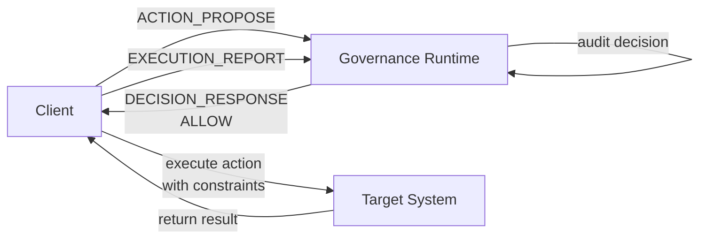
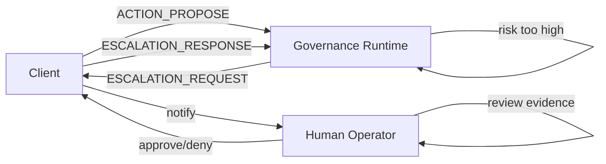
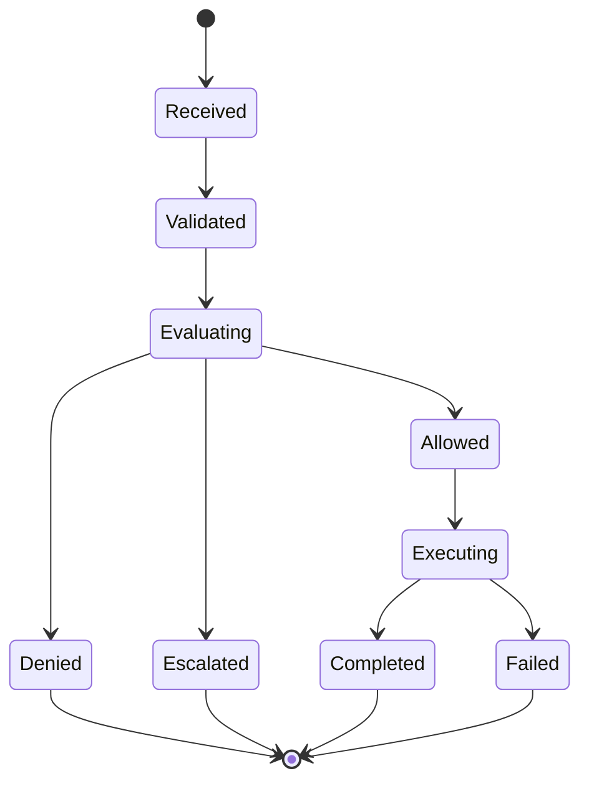
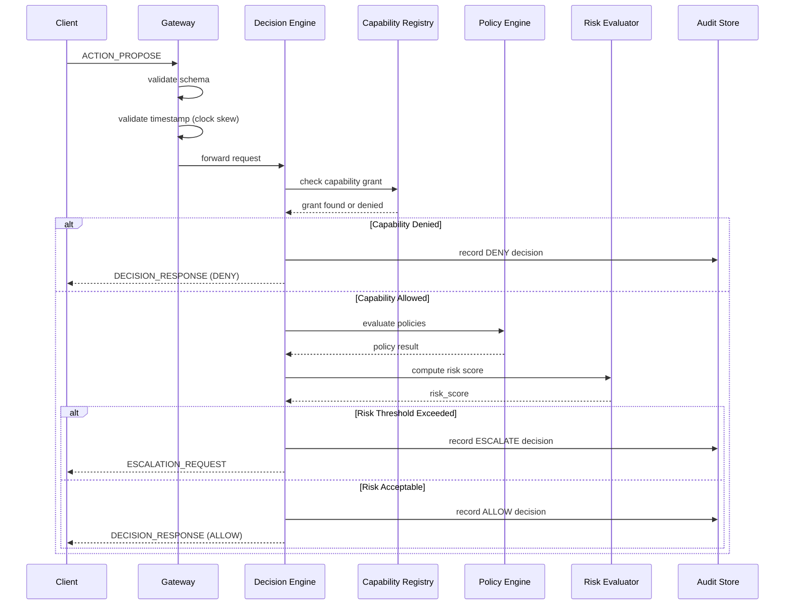
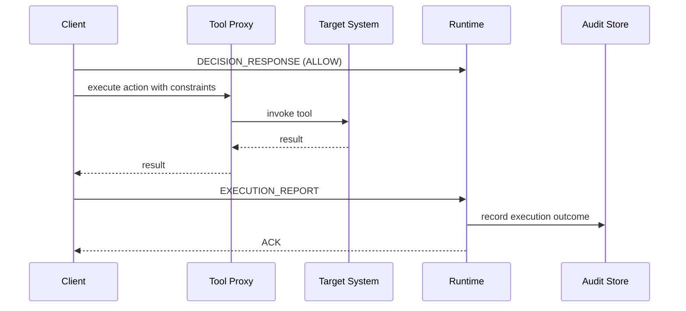

# AEGIS Governance Protocol (AGP-1)

**Version:** 1.0  
**Status:** Normative  
**Last Updated:** March 5, 2026  
**Authors:** AEGIS Project

---

## Table of Contents

1. [Overview](#overview)
2. [Protocol Versioning and Negotiation](#protocol-versioning-and-negotiation)
3. [Authentication and Authorization](#authentication-and-authorization)
4. [Message Schemas](#message-schemas)
5. [Protocol Flow Diagrams](#protocol-flow-diagrams)
6. [Wire Format Specification](#wire-format-specification)
7. [Error Handling](#error-handling)
8. [Sequence Diagrams](#sequence-diagrams)
9. [Transport Requirements](#transport-requirements)
10. [Deployment and Configuration](#deployment-and-configuration)

---

## 1. Overview

### 1.1 Purpose

The AEGIS Governance Protocol (AGP-1) defines the request-response contract between AI-based systems (clients) and the AEGIS governance runtime (server).

AGP-1 ensures that operational action proposals are deterministically evaluated against capability, policy, and risk constraints before execution.

### 1.2 Core Principles

- **Deterministic Governance**: identical requests and policy versions produce identical decisions
- **Default Deny**: absence of explicit authorization yields denial
- **Complete Attribution**: every request includes authenticated actor identity
- **Immutable Audit**: every decision is persisted for audit and compliance
- **Fail-Closed Semantics**: all subsystem failures result in denial or escalation, never implicit allow

### 1.3 Message Categories

AGP-1 defines six message categories:

| Message | Direction | Purpose |
|---------|-----------|---------|
| `ACTION_PROPOSE` | Client → Server | Propose operational action |
| `DECISION_RESPONSE` | Server → Client | Return governance decision |
| `EXECUTION_REPORT` | Client → Server | Report execution outcome |
| `ESCALATION_REQUEST` | Server → Client | Request human review |
| `AUDIT_QUERY` | Client → Server | Retrieve audit evidence |
| `HEALTH_CHECK` | Either → Either | Protocol health and versioning |

---

## 2. Protocol Versioning and Negotiation

### 2.1 Semantic Versioning

AGP versions follow semantic versioning: `MAJOR.MINOR.PATCH`

- `MAJOR`: breaking changes in request/response schema
- `MINOR`: additive fields; backward compatible
- `PATCH`: bug fixes; no schema changes

Current stable version: **1.0.0**

### 2.2 Version Negotiation Handshake

Clients MUST indicate supported versions when initiating communication.

```json
{
  "agp_versions_supported": ["1.0.0", "1.1.0"],
  "minimum_version": "1.0.0",
  "client_version_string": "aegis-client/1.0.0"
}
```

Servers MUST respond with negotiated version:

```json
{
  "agp_version_selected": "1.0.0",
  "policy_set_version": "2026.03.05",
  "server_version_string": "aegis-runtime/1.0.0"
}
```

### 2.3 Compatibility Rules

- clients MUST accept minor version upgrades without change
- clients MUST reject unsupported major versions
- servers MUST maintain backward compatibility for N-1 major versions

---

## 3. Authentication and Authorization

### 3.1 Client Authentication

Every AGP message MUST include authentication credentials.

Supported mechanisms:

#### 3.1.1 Bearer Token (HTTP Authorization header)

```
Authorization: Bearer <jwt-token>
```

JWT claims MUST include:

```json
{
  "iss": "aegis-trust-domain",
  "sub": "agent:soc-001",
  "aud": "aegis-governance-runtime",
  "iat": 1709624400,
  "exp": 1709628000,
  "scope": "governance:propose_action",
  "service_account": "soc-automation"
}
```

#### 3.1.2 Mutual TLS (mTLS)

Client certificate MUST include:

```
Subject: CN=soc-agent-001, O=example.com, C=US
Extended Key Usage: Client Authentication
```

Server MUST validate:
- certificate signature against trust root
- certificate not expired
- CN maps to authorized actor_id

#### 3.1.3 API Key (deprecated; supported only in AGP-1.0)

```
X-API-Key: <base64-encoded-key>
X-Client-ID: agent:soc-001
```

### 3.2 Authorization Scopes

Valid scopes in authentication token:

| Scope | Permission |
|-------|-----------|
| `governance:propose_action` | Submit ACTION_PROPOSE messages |
| `governance:query_audit` | Retrieve audit records |
| `governance:escalate_decision` | Respond to ESCALATION_REQUEST |
| `governance:health_check` | Check protocol health |

Actor MUST have appropriate scope or request is rejected with `UNAUTHORIZED_ACTOR` error.

### 3.3 Request Attribution

Every message MUST include explicit actor identification. This is how the governance runtime binds decisions to responsible actors.

```json
{
  "actor_id": "agent:soc-001",
  "actor_type": "ai_system",
  "authentication_method": "bearer_token"
}
```

Supported `actor_type` values:

- `ai_system`: autonomous AI agent or copilot
- `human_user`: direct human interaction
- `automated_system`: non-AI automation (CI/CD, scheduled task)

---

## 4. Message Schemas

### 4.1 ACTION_PROPOSE Message

Client proposes an operational action for governance evaluation.

```json
{
  "agp_version": "1.0.0",
  "message_type": "ACTION_PROPOSE",
  "message_id": "msg-20260305-abc123",
  "request_id": "req-soc-001-12345",
  "timestamp": "2026-03-05T14:30:00Z",
  "actor_id": "agent:soc-001",
  "actor_type": "ai_system",
  "capability": "telemetry.query",
  "action_type": "tool_call",
  "target": "siem.search",
  "parameters": {
    "query": "source_ip=192.168.1.100 AND event_type=failed_login",
    "time_window_minutes": 15,
    "max_results": 1000
  },
  "context": {
    "session_id": "sess-abc-def-ghi",
    "environment": "production",
    "trace_id": "trace-20260305-001",
    "source_system": "security-orchestrator",
    "request_priority": "high",
    "urgency_justification": "active_incident_response"
  },
  "constraints": {
    "max_compute_seconds": 30,
    "require_encryption": true,
    "require_confidential_handling": true
  }
}
```

#### 4.1.1 Field Specification

| Field | Type | Required | Description |
|-------|------|----------|-------------|
| `agp_version` | string | yes | Protocol version; must match negotiated version |
| `message_type` | enum | yes | Must be `ACTION_PROPOSE` |
| `message_id` | uuid | yes | Unique message identifier; prevents replay |
| `request_id` | string | yes | Business request identifier; links to audit trail |
| `timestamp` | RFC3339 | yes | ISO 8601 UTC timestamp; must be within ±5 min of server time |
| `actor_id` | string | yes | Authenticated actor identifier; must match auth token |
| `actor_type` | enum | yes | `ai_system`, `human_user`, or `automated_system` |
| `capability` | string | yes | Governance capability being requested; must be registered |
| `action_type` | enum | yes | `tool_call`, `file_operation`, `network_access`, `data_access`, `system_action` |
| `target` | string | yes | Fully qualified resource identifier; e.g., `siem.search`, `s3://bucket/path` |
| `parameters` | object | yes | Action-specific parameters; schema varies by `target` |
| `context` | object | yes | Contextual metadata for decision making |
| `constraints` | object | no | Additional operational constraints |

#### 4.1.2 Parameter Validation Rules

- `capability` MUST be registered in Capability Registry
- `actor_id` MUST match authentication token subject
- `target` MUST conform to resource naming convention (see section 6.1)
- `timestamp` MUST NOT be older than 5 minutes (clock skew tolerance)
- `parameters` keys MUST match approved vocabulary for `action_type`

### 4.2 DECISION_RESPONSE Message

Server returns governance decision.

```json
{
  "agp_version": "1.0.0",
  "message_type": "DECISION_RESPONSE",
  "message_id": "msg-20260305-def456",
  "request_id": "req-soc-001-12345",
  "timestamp": "2026-03-05T14:30:01Z",
  "decision": "ALLOW",
  "decision_reason": "matches policy 'telemetry_query_soc_allowed'",
  "policy_set_version": "2026.03.05",
  "audit_event_id": "audit-evt-789xyz",
  "risk_score": 2.4,
  "risk_category": "data_access",
  "decision_confidence": 0.99,
  "applied_constraints": {
    "max_results": 500,
    "timeout_ms": 15000,
    "encryption_required": true
  },
  "policy_trace": {
    "evaluated_policies": [
      "deny_untrusted_actors",
      "telemetry_query_soc_allowed",
      "risk_threshold_monitor"
    ],
    "matching_policy_id": "telemetry_query_soc_allowed",
    "evaluation_duration_ms": 12
  }
}
```

#### 4.2.1 Field Specification

| Field | Type | Required | Description |
|-------|------|----------|-------------|
| `decision` | enum | yes | `ALLOW`, `DENY`, `ESCALATE`, `REQUIRE_CONFIRMATION` |
| `decision_reason` | string | yes | Human-readable explanation of decision |
| `policy_set_version` | string | yes | Version of policy set used for evaluation |
| `audit_event_id` | string | yes | Link to immutable audit record |
| `risk_score` | float | yes | [0.0 - 10.0]; higher = riskier |
| `risk_category` | string | yes | Category of risk: `data_access`, `system_control`, `capability_elevation`, `behavioral_anomaly` |
| `decision_confidence` | float | yes | [0.0 - 1.0]; confidence in decision determinism |
| `applied_constraints` | object | no | Constraints enforced by governance (for ALLOW decisions) |
| `policy_trace` | object | yes | Decision evaluation trace; auditable proof of governance |

#### 4.2.2 Possible Decision Outcomes

**ALLOW**: action is permitted with optional constraints
- client MAY proceed to execution
- constraints MUST be enforced

**DENY**: action is explicitly forbidden
- client MUST NOT proceed to execution
- reason explains policy violation

**ESCALATE**: action requires human review
- client MUST pause and request human intervention
- system displays reason and evidence to human operator

**REQUIRE_CONFIRMATION**: client must explicitly confirm before execution
- used for novel or high-risk actions
- client must re-submit with explicit confirmation flag

### 4.3 EXECUTION_REPORT Message

Client reports execution outcome of approved action.

```json
{
  "agp_version": "1.0.0",
  "message_type": "EXECUTION_REPORT",
  "message_id": "msg-20260305-ghi789",
  "request_id": "req-soc-001-12345",
  "audit_event_id": "audit-evt-789xyz",
  "timestamp": "2026-03-05T14:30:15Z",
  "actor_id": "agent:soc-001",
  "execution_status": "completed",
  "exit_code": 0,
  "output_summary": "returned 234 matching events",
  "duration_ms": 8450,
  "errors": null,
  "resource_utilization": {
    "cpu_seconds": 2.3,
    "memory_mb": 128,
    "network_bytes_sent": 54000
  }
}
```

#### 4.3.1 Execution Status Codes

| Status | Meaning | Typical Action |
|--------|---------|--------|
| `completed` | Action succeeded | audit success, return results |
| `failed` | Action failed within tool | audit failure, return error |
| `timeout` | Action exceeded time limit | audit timeout, escalate if critical |
| `permission_denied` | Tool rejected request | audit permission denial, investigate |
| `aborted_by_user` | User cancelled operation | audit cancellation |

#### 4.3.2 Field Specification

| Field | Type | Required | Description |
|-------|------|----------|-------------|
| `execution_status` | enum | yes | See status codes above |
| `exit_code` | integer | no | Return code from tool execution |
| `output_summary` | string | yes | Brief summary of execution outcome |
| `duration_ms` | integer | yes | Wall-clock time for execution in milliseconds |
| `errors` | string | no | Error message if status is `failed` |
| `resource_utilization` | object | no | Telemetry for cost/performance tracking |

### 4.4 ESCALATION_REQUEST Message

Server requests human review for a decision.

```json
{
  "agp_version": "1.0.0",
  "message_type": "ESCALATION_REQUEST",
  "message_id": "msg-20260305-jkl012",
  "request_id": "req-soc-001-99999",
  "timestamp": "2026-03-05T14:35:00Z",
  "escalation_id": "esc-abc-def-ghi",
  "reason": "capability_not_found",
  "severity": "high",
  "action_summary": {
    "capability": "infrastructure.deploy",
    "target": "prod-kubernetes-cluster",
    "context": "deploying security patch to production"
  },
  "evidence": {
    "requested_capability": "infrastructure.deploy",
    "known_similar_capabilities": ["infrastructure.deploy_staging", "infrastructure.modify"],
    "risk_analysis": "high-risk operation on production system"
  },
  "required_human_actions": [
    "verify_actor_identity",
    "confirm_business_justification",
    "approve_execution"
  ],
  "expire_at": "2026-03-05T15:35:00Z"
}
```

### 4.5 AUDIT_QUERY Message

Client queries audit trail.

```json
{
  "agp_version": "1.0.0",
  "message_type": "AUDIT_QUERY",
  "message_id": "msg-20260305-mno345",
  "timestamp": "2026-03-05T16:00:00Z",
  "actor_id": "analyst:compliance-001",
  "query_type": "by_request_id",
  "filters": {
    "request_id": "req-soc-001-12345"
  },
  "limit": 10
}
```

### 4.6 HEALTH_CHECK Message

Either party may initiate health check.

```json
{
  "agp_version": "1.0.0",
  "message_type": "HEALTH_CHECK",
  "message_id": "msg-20260305-pqr678",
  "timestamp": "2026-03-05T16:05:00Z",
  "initiator": "client"
}
```

Response:

```json
{
  "agp_version": "1.0.0",
  "message_type": "HEALTH_CHECK_RESPONSE",
  "message_id": "msg-20260305-stu901",
  "timestamp": "2026-03-05T16:05:01Z",
  "status": "healthy",
  "policy_set_hash": "sha256:abc...def",
  "capability_registry_status": "operational",
  "audit_store_status": "operational",
  "decision_engine_version": "1.0.0"
}
```

---

## 5. Protocol Flow Diagrams

### 5.1 Happy Path: Allow Decision



### 5.2 Escalation Flow



### 5.3 State Machine



---

## 6. Wire Format Specification

### 6.1 Transport

#### 6.1.1 HTTP/1.1 or HTTP/2

**Endpoint**: `/aegis/v1/governance`

**Methods**:
- `POST /aegis/v1/governance/propose` → ACTION_PROPOSE
- `GET /aegis/v1/governance/decision/{message_id}` → retrieve DECISION_RESPONSE
- `POST /aegis/v1/governance/report` → EXECUTION_REPORT
- `POST /aegis/v1/governance/audit/query` → AUDIT_QUERY
- `GET /aegis/v1/governance/health` → HEALTH_CHECK

**Required Headers**:

```
Content-Type: application/json; charset=utf-8
Authorization: Bearer <token> | X-Client-Cert: <fingerprint>
X-Trace-ID: <trace-id>
X-Request-ID: <request-id>
```

**Optional Headers**:

```
X-Idempotency-Key: <uuid>  (for replay protection)
X-Priority: high | normal | low
User-Agent: aegis-client/1.0.0
```

#### 6.1.2 Protocol Buffers (for high-throughput deployments)

Alternative wire format using protocol buffers.

```proto
syntax = "proto3";

package aegis.governance;

message ActionPropose {
  string agp_version = 1;
  string message_type = 2;
  string message_id = 3;
  string request_id = 4;
  string timestamp = 5;
  string actor_id = 6;
  string actor_type = 7;
  string capability = 8;
  string action_type = 9;
  string target = 10;
  google.protobuf.Struct parameters = 11;
  google.protobuf.Struct context = 12;
}
```

### 6.2 Request Envelope

All requests MUST include envelope:

```json
{
  "envelope_version": "1.0",
  "message": { ... },
  "signature": {
    "algorithm": "hmac-sha256 | ed25519",
    "key_id": "...",
    "signature_bytes": "base64url(...)"
  }
}
```

Signature is OPTIONAL for requests over authenticated TLS channel.

### 6.3 Response Envelope

All responses MUST include envelope:

```json
{
  "envelope_version": "1.0",
  "message": { ... },
  "timestamp": "2026-03-05T14:30:01Z",
  "server_version": "aegis-runtime/1.0.0"
}
```

### 6.4 Content Encoding

- Preferred: `application/json` (UTF-8)
- Efficient: `application/protobuf` for high-throughput
- Compressed: `gzip` for payloads > 4KB

---

## 7. Error Handling

### 7.1 Error Response Envelope

```json
{
  "error": {
    "error_code": "INVALID_REQUEST",
    "error_message": "field 'capability' must be non-empty string",
    "http_status": 400,
    "request_id": "req-soc-001-12345",
    "timestamp": "2026-03-05T14:30:01Z",
    "retryable": false,
    "details": {
      "field": "capability",
      "constraint": "non-empty string",
      "received": ""
    }
  }
}
```

### 7.2 Error Code Reference

| Error Code | HTTP Status | Retryable | Meaning |
|------------|------------|-----------|---------|
| `INVALID_REQUEST` | 400 | No | Malformed request; validation failed |
| `INVALID_MESSAGE_ID` | 400 | No | Message ID format invalid |
| `INVALID_ACTION_TYPE` | 400 | No | Action type not recognized |
| `UNAUTHORIZED_ACTOR` | 401 | No | Actor not authenticated or scope insufficient |
| `ACTOR_ID_MISMATCH` | 401 | No | Actor ID in message differs from auth token |
| `FORBIDDEN_CAPABILITY` | 403 | No | Actor not authorized for requested capability |
| `CAPABILITY_NOT_FOUND` | 404 | No | Capability not registered |
| `POLICY_EVALUATION_ERROR` | 500 | Yes | Policy engine raised exception |
| `RISK_ENGINE_ERROR` | 500 | Yes | Risk computation failed |
| `AUDIT_STORAGE_ERROR` | 503 | Yes | Audit write failed; request queued for retry |
| `RATE_LIMIT_EXCEEDED` | 429 | Yes | Too many requests; back off and retry |
| `SERVER_OVERLOADED` | 503 | Yes | Server busy; retry after exponential backoff |
| `TIMEOUT` | 504 | Yes | Request processing exceeded timeout |
| `UNSUPPORTED_AGP_VERSION` | 406 | No | Requested AGP version not supported |
| `INTERNAL_SERVER_ERROR` | 500 | Maybe | Unexpected error; check logs |

### 7.3 Retry Semantics

**Retryable Errors** (HTTP 5xx, 429):
- client SHOULD retry with exponential backoff
- recommended backoff: [100ms, 500ms, 2500ms, 12500ms]
- max retries: 5

**Non-Retryable Errors** (HTTP 4xx):
- client MUST NOT retry
- fix the request or escalate to human

---

## 8. Sequence Diagrams

### 8.1 Standard Decision Flow



### 8.2 Escalation and Human Review

```mermaid
sequenceDiagram
    participant CL as Client
    participant RT as Runtime
    participant HM as Human Operator
    participant AS as Audit Store

    CL->>RT: ACTION_PROPOSE
    RT->>RT: evaluate; risk high
    RT->>AS: record ESCALATE decision
    RT-->>CL: ESCALATION_REQUEST
    CL->>HM: display escalation
    HM->>HM: review evidence
    HM->>CL: approve or deny
    CL->>RT: ESCALATION_RESPONSE (approved)
    RT->>AS: record approval
    RT-->>CL: DECISION_RESPONSE (ALLOW)
```

### 8.3 Execution and Reporting



---

## 9. Transport Requirements

### 9.1 TLS/HTTPS (Mandatory)

- TLS 1.2 minimum, 1.3 preferred
- AEAD cipher suites only (no RC4, DES, MD5 hashes)
- MUST apply HSTS header: `Strict-Transport-Security: max-age=31536000; includeSubDomains`

### 9.2 Mutual TLS (Recommended)

Server MUST offer mTLS endpoint:
- Server presents certificate signed by trusted CA
- Client MUST present certificate
- Server MUST validate client certificate chain

### 9.3 Keepalive

HTTP/2 or persistent HTTP/1.1 connections recommended.
Target connection reuse: 95%+ for performance.

### 9.4 Timeout Settings

- connection timeout: 10 seconds
- request timeout: 30 seconds
- idle keepalive: 90 seconds

### 9.5 DNS Resolution

Clients SHOULD cache DNS for up to 5 minutes to improve resilience to temporary DNS failures.

---

## 10. Deployment and Configuration

### 10.1 Configuration Parameters

```yaml
agp:
  version: "1.0.0"
  port: 443
  tls:
    enabled: true
    min_version: "1.2"
    cipher_suites:
      - TLS_ECDHE_RSA_WITH_AES_256_GCM_SHA384
      - TLS_ECDHE_RSA_WITH_CHACHA20_POLY1305
  rate_limiting:
    requests_per_minute: 1000
    burst_size: 50
  timeout:
    decision_max_ms: 500
    audit_write_max_ms: 2000
  authentication:
    required_scopes: ["governance:propose_action"]
    token_validation_endpoint: "https://auth.example.com/.well-known/jwks.json"
    clock_skew_tolerance_seconds: 300
```

### 10.2 Health and Readiness Probes

Kubernetes health endpoints:

```
GET /aegis/health            → true if operational
GET /aegis/ready             → true if all dependencies reachable
GET /aegis/metrics/agp       → prometheus metrics
```

### 10.3 Monitoring and Telemetry

AGP implementations MUST emit to Prometheus:

```
aegis_agp_requests_total{message_type, decision, status}
aegis_agp_latency_ms{message_type, percentile}
aegis_agp_errors_total{error_code}
aegis_decision_determinism_score
```

### 10.4 Debugging and Logging

All messages SHOULD include `X-Trace-ID` header for distributed tracing.

Log levels:

- DEBUG: full message payloads (redact secrets)
- INFO: message type, actor, capability, decision
- WARN: errors, timeouts, policy exceptions
- ERROR: authentication failures, storage failures
- CRITICAL: subsystem unavailability

---

## 11. Example Scenarios

### 11.1 Complete Happy Path

**Client Request**:
```json
{
  "agp_version": "1.0.0",
  "message_type": "ACTION_PROPOSE",
  "message_id": "msg-001",
  "request_id": "req-incident-2026-001",
  "timestamp": "2026-03-05T14:30:00Z",
  "actor_id": "agent:soc-001",
  "actor_type": "ai_system",
  "capability": "telemetry.query",
  "action_type": "tool_call",
  "target": "siem.search",
  "parameters": {
    "query": "source_ip=192.168.1.100 AND failed_login_count > 5",
    "time_window_minutes": 15
  },
  "context": {
    "session_id": "sess-001",
    "environment": "production",
    "trace_id": "trace-001"
  }
}
```

**Server Response (ALLOW)**:
```json
{
  "agp_version": "1.0.0",
  "message_type": "DECISION_RESPONSE",
  "request_id": "req-incident-2026-001",
  "decision": "ALLOW",
  "decision_reason": "SOC analyst within policy guardrails",
  "audit_event_id": "audit-evt-001",
  "risk_score": 1.5,
  "policy_trace": {
    "matching_policy_id": "soc_telemetry_allowed"
  }
}
```

**Client Execution Report**:
```json
{
  "agp_version": "1.0.0",
  "message_type": "EXECUTION_REPORT",
  "request_id": "req-incident-2026-001",
  "audit_event_id": "audit-evt-001",
  "execution_status": "completed",
  "output_summary": "returned 12 matching events",
  "duration_ms": 245
}
```

### 11.2 Escalation Case

**Server Request** (escalation):
```json
{
  "agp_version": "1.0.0",
  "message_type": "ESCALATION_REQUEST",
  "escalation_id": "esc-001",
  "reason": "action_novel_capability",
  "severity": "high"
}
```

**Human approves** → client re-submits with confirmation flag.

---

## 12. Relationship to Other Specifications

- **RFC-0001**: AEGIS Architecture and security guarantees
- **RFC-0002**: Governance Runtime API (complements AGP-1)
- **RFC-0003**: Capability Registry and Policy semantics
- **RFC-0004**: Governance Event Model for federation

---

## 13. Appendix: Backward Compatibility Notes

AGP-1.0 is the first stable release. Future versions will maintain backward compatibility per semantic versioning rules:

- v1.1: additive optional fields
- v2.0: reserved for breaking schema changes

---

**Document Status**: Normative  
**Last Reviewed**: March 5, 2026  
**Next Review**: June 5, 2026
