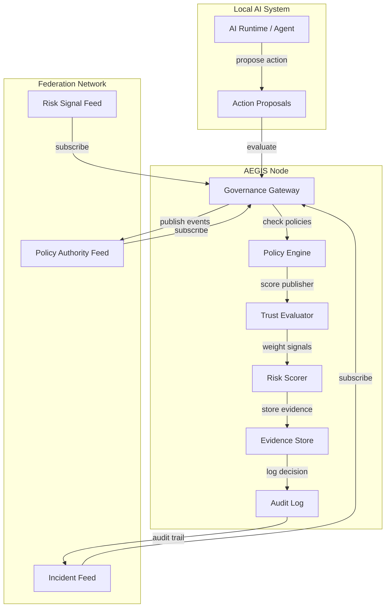
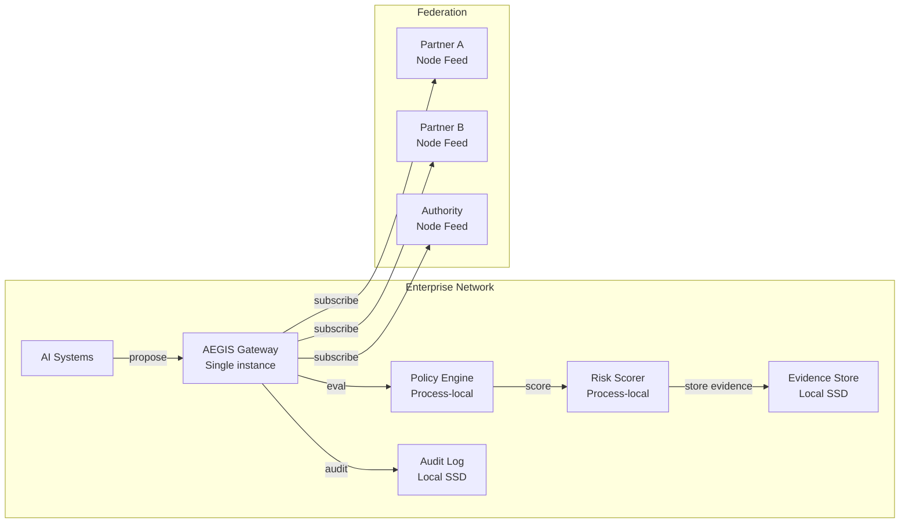
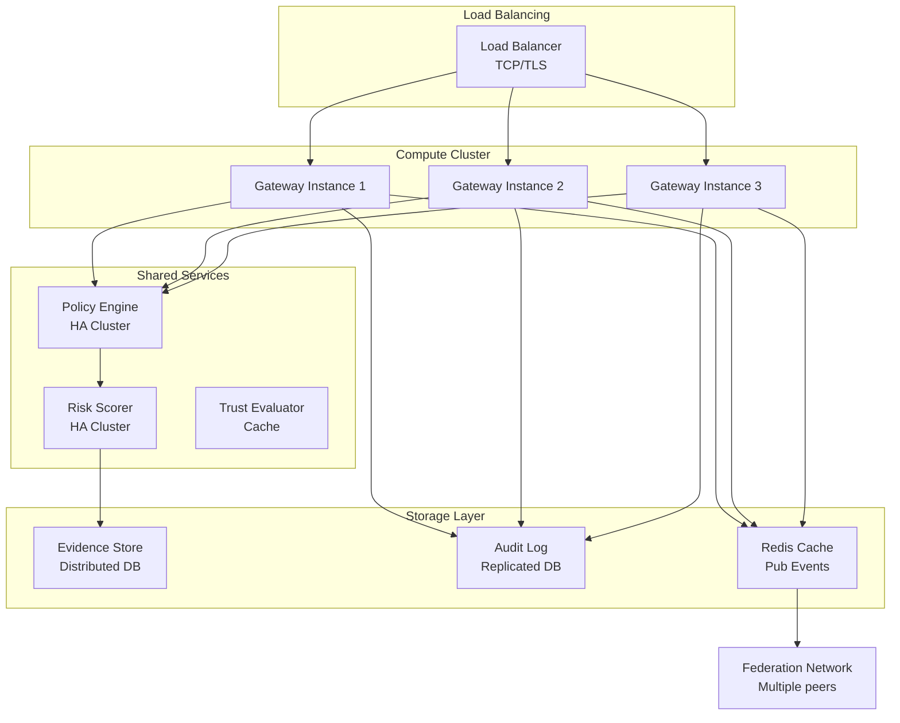
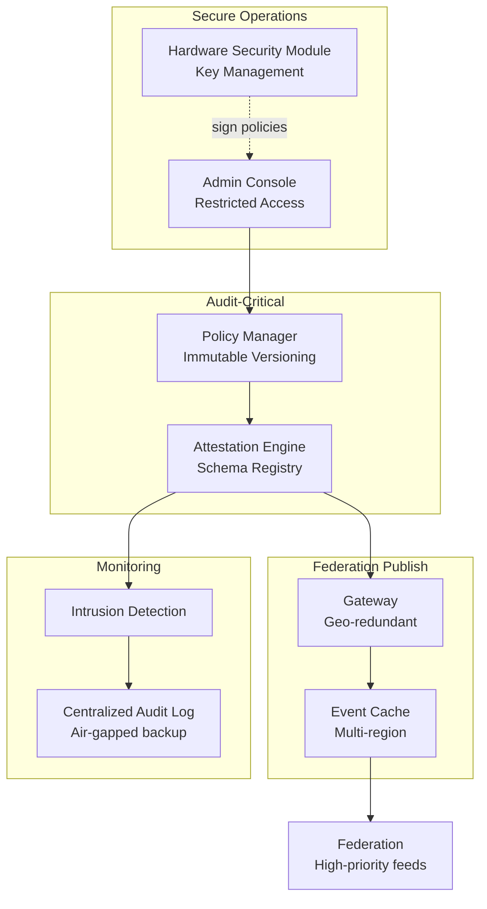
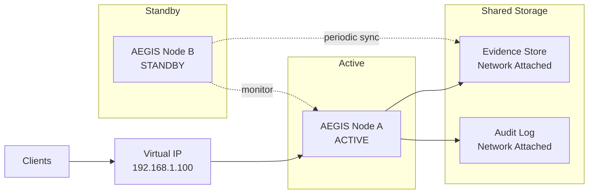
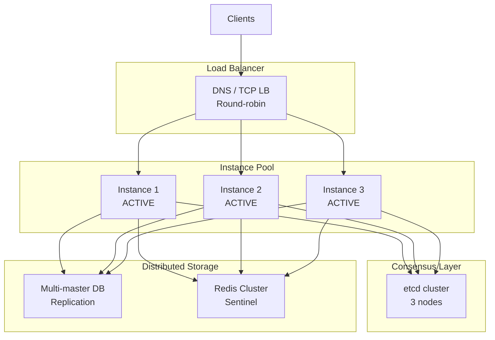

# AEGIS™ GFN-1 Node Reference Architecture & Deployment

**Document**: GFN-1/Nodes (AEGIS_GFN1_NODE_REFERENCE_ARCHITECTURE.md)
**Version**: 1.0 (Normative)
**Part of**: AEGIS Governance Federation Network
**Last Updated**: March 6, 2026

---

This document defines a **normative reference architecture** for AEGIS nodes participating in the Governance Federation Network (GFN). It provides concrete guidance on component design, deployment topologies, performance requirements, high-availability patterns, and disaster recovery strategies. This architecture is implementation-agnostic but operationally prescriptive.

## Table of Contents

1. [Node Responsibilities](#1-responsibilities)
2. [Architecture Overview](#2-architecture-overview)
3. [Component Specifications](#3-component-specifications)
4. [Interface Specifications](#4-interface-specifications)
5. [Deployment Architectures](#5-deployment-architectures)
6. [Performance & Scaling Requirements](#6-performance--scaling-requirements)
7. [High-Availability & Disaster Recovery](#7-high-availability--disaster-recovery)
8. [Security Requirements](#8-security-requirements)
9. [Operational Readiness](#9-operational-readiness)
10. [Appendices](#10-appendices)

---

## 1. Responsibilities

An AEGIS node MUST support:

1. **Governance signal publication** - publish structured events to federation feeds
2. **Governance feed subscription** - ingest signals from curated peer nodes and policy authorities
3. **Local policy enforcement integration** - bind federation signals to local access control decisions[^4]
4. **Trust evaluation and reputation weighting** - assign credibility scores to external signals
5. **Audit logging and evidence retention** - maintain immutable records of all decisions and sources[^1]
6. **Privacy controls and selective disclosure** - redact sensitive data before publication per configured policies

---

## 2. Architecture Overview

AEGIS nodes exhibit a **layered, event-driven architecture** designed for federation at scale. The reference design consists of:

- **Signal Boundary Layer**: Ingress/egress points for federation events
- **Trust & Policy Evaluation Layer**: Reputation weighting and decision enforcement[^17]
- **Audit & Compliance Layer**: Immutable logging and evidence management
- **Operational Layer**: Identity, key management, observability, storage
- **Integration Layer**: Bridges to local governance and risk systems

### 2.1 High-Level Architecture Diagram



---

## 3. Component Specifications

### 3.1 Governance Gateway (AT Protocol Adapter)

- Publishes AEGIS events via AT Protocol records
- Subscribes to governance feeds
- Handles identity keys and signing/verification

### 3.1 Governance Gateway (AT Protocol Adapter)

**Purpose**: Bi-directional event transport for federation communication

**Responsibilities**:

- Publish signed AEGIS events to configured feeds via AT Protocol
- Subscribe to governance feeds from policy authorities and peer nodes
- Verify event signatures and validate schemas before propagation to downstream components
- Implement replay protection via event_id + timestamp windowing (default: 1 hour)
- Handle feed subscription lifecycle, reconnection, and backpressure management

**Technical Requirements**:

- Support AT Protocol SDK (minimum v2.0)
- Maintain persistent subscriptions with automatic reconnection (exponential backoff: 1s → 30s)
- Verify all signatures against DID document published keys
- Enforce schema validation before acceptance of any event
- Implement TLS 1.3 for all network communications
- Support proxy/firewall traversal (HTTP/1.1 and HTTP/2)

**Data Model**:

```json
{
  "gateway_config": {
    "at_service_url": "https://at-service.example.com",
    "feeds": [
      {
        "name": "policy-authority-main",
        "uri": "feed::<authority-did>/policy-updates",
        "did": "did:aegis:main:authority-node-1",
        "subscription_mode": "live",
        "buffer_mode": "fifo",
        "max_buffer_depth": 10000
      }
    ],
    "publication_config": {
      "local_did": "did:aegis:main:node-instance-1",
      "signing_key_id": "signing-key-v1",
      "publication_feeds": ["incident", "risk-signal", "telemetry"]
    }
  }
}
```

---

### 3.2 Policy Engine (Local Evaluation)

- Evaluates inputs/outputs/actions against governance policies
- Enforces capability boundaries and required controls
- Produces local governance telemetry for publication (aggregated)

### 3.2 Policy Engine (Local Evaluation)

**Purpose**: Evaluate local actions against federation-informed governance policies

**Responsibilities**:

- Load and maintain policy rule sets from local configuration and federation feeds
- Evaluate proposed actions against policies, returning ALLOW/DENY/REQUIRES_REVIEW decisions
- Integrate federation signals (via Trust Evaluator) into decision reasoning
- Produce local policy telemetry (aggregate statistics, decision logs)
- Support policy versioning, rollback, and hot-reload without service interruption

**Technical Requirements**:

- Implement deterministic policy evaluation with guaranteed latency SLAs (p99 < 50ms for simple policies)
- Support policy language: AEGIS Policy DSL (EBNF defined in RFC-0003)
- Maintain policy state machine preventing conflicting concurrent updates
- Log all policy decisions with supporting context for audit trail
- Support debug/trace mode for policy diagnostics

**Decision Output**:

```json
{
  "decision_id": "dec_abc123def456",
  "timestamp": "2026-03-05T10:30:00Z",
  "action_id": "act_xyz789",
  "decision": "ALLOW",
  "decision_rationale": "Action matched safe-list policy; federation signals: no contradictions",
  "confidence_score": 0.95,
  "policies_evaluated": 3,
  "federation_signals_considered": 2,
  "required_controls": ["audit_log"],
  "ttl_seconds": 3600
}
```

---

### 3.3 Risk Scoring Service

- Computes risk scores per request/session/action
- Consumes external risk signals (network feeds) to adjust scoring
- Produces risk telemetry for publication (aggregate + anonymized)

### 3.3 Risk Scoring Service

**Purpose**: Compute contextual risk scores for actions by integrating local telemetry and federation signals

**Responsibilities**:

- Compute risk scores for proposed actions (0.0 = safe, 1.0 = critical risk)
- Consume federation risk signals to adjust baseline risk priors
- Track risk signal recency and weight newer signals more heavily
- Maintain risk signal cache with TTLs (default: 1 hour per source)
- Publish aggregate risk telemetry to risk-signal feed (privacy-redacted)

**Technical Requirements**:

- Implement risk scoring algorithm with bounded computation time (p99 < 100ms)
- Support configurable risk factors and weighting (default: 5 primary factors)
- Cache risk signals with automatic eviction (LRU, max 100K signals)
- Support risk signal subscriptions from multiple independent sources
- Implement anomaly detection to flag statistically unusual risk patterns

**Risk Score Breakdown**:

```json
{
  "action_id": "act_xyz789",
  "overall_risk": 0.52,
  "base_risk_score": 0.40,
  "risk_components": {
    "historical_attempt_rate": 0.30,
    "federation_incident_signals": 0.15,
    "capability_sensitivity": 0.50,
    "velocity_anomaly": 0.10,
    "reputation_decay": 0.02
  },
  "federation_signals_applied": 3,
  "signal_ages_seconds": [120, 240, 890],
  "recommendation": "ALLOW_WITH_MONITORING"
}
```

---

### 3.4 Trust & Reputation Evaluator

- Assigns weights to incoming events based on:
  - publisher reputation
  - policy authority status
  - audit/attestation level
  - historical accuracy
- Generates a local `trust_profile` used by policy/risk systems

### 3.4 Trust & Reputation Evaluator

**Purpose**: Assign credibility weights to external federation signals based on publisher reputation

**Responsibilities**:

- Maintain trust scores for known publisher DIDs using 5-factor model from AEGIS_GFN1_TRUST_MODEL.md
- Apply trust weights to ingested events (multiply signal strength by publisher trust score)
- Detect compromised publishers via contradictory signals and revocation notices
- Enforce trust revocation procedures (automatic and manual)
- Publish local trust evaluation results for federation transparency

**Technical Requirements**:

- Implement trust score calculation (formula: 0.30×B + 0.25×H + 0.20×Q + 0.15×A + 0.10×F)
- Support trust score caching with refresh intervals (default: 1 hour)
- Detect trust score degradation patterns (3+ contradictions trigger quarantine)
- Support trust recovery procedures (require re-attestation after remediation)
- Maintain trust graph showing publisher relationships and corroboration

**Publisher Rating Output**:

```json
{
  "publisher_did": "did:aegis:main:publisher-node-42",
  "trust_score": 0.82,
  "trust_factors": {
    "baseline_authority": 0.90,
    "historical_accuracy": 0.78,
    "quality_signals": 0.85,
    "audit_posture": 0.75,
    "federation_reputation": 0.81
  },
  "authority_level": "L2_TRUSTED",
  "signal_multiplier": 0.82,
  "last_verified": "2026-03-05T09:30:00Z",
  "next_review": "2026-03-05T10:30:00Z",
  "events_evaluated": 450,
  "accuracy_rate": 0.96
}
```

---

### 3.5 Evidence Store

- Stores artifacts supporting attestations and incidents
- Provides signed URIs for authorized retrieval
- Enforces retention, access policies, and redaction

### 2.6 Observability & Audit

- Immutable logs of:
  - published events (hash + timestamp)
  - ingested events (hash + verification result)
  - policy/risk decisions
- Supports compliance and incident investigations

### 3.5 Evidence Store

**Purpose**: Secure storage for evidence supporting attestations, incidents, and policy decisions

**Responsibilities**:

- Store evidence artifacts (logs, captures, attestations) with access controls
- Generate signed URIs for authorized evidence retrieval
- Enforce retention policies (default: 90 days for incidents, configurable per evidence class)
- Support evidence redaction before federation publication
- Provide evidence integrity verification (hash chain, cryptographic proofs)

**Technical Requirements**:

- Encrypt all evidence at rest (AES-256, with key rotation every 90 days)
- Support at least 1TB of evidence storage (configurable per deployment)
- Implement access control: evidence only accessible to authorized roles after approval
- Generate tamper-evident integrity proofs (Merkle tree hashing)
- Support evidence classification: PUBLIC, INTERNAL, RESTRICTED, CLASSIFIED

**Evidence Metadata**:

```json
{
  "evidence_id": "ev_def789abc",
  "incident_id": "inc_123xyz",
  "created_timestamp": "2026-03-05T10:15:00Z",
  "evidence_type": "system_log_snapshot",
  "classification": "INTERNAL",
  "size_bytes": 4096,
  "hash_sha256": "abc123def...",
  "retention_days": 90,
  "access_control": {
    "roles": ["incident_investigator", "audit_reviewer"],
    "required_approvals": 1
  },
  "redaction_rules": ["remove_user_ids", "remove_ip_addresses"],
  "integrity_chain": ["hash_parent_1", "hash_parent_2"]
}
```

---

### 3.6 Observability & Audit

**Purpose**: Immutable logging and operational visibility for all node activities

**Responsibilities**:

- Log all published/ingested events with verification results
- Record all policy/risk/trust decisions with supporting context
- Maintain hash chain (cryptographic chain of evidence) for audit trail integrity
- Provide structured metrics for operational monitoring (Prometheus compatible)
- Support audit log querying and forensics

**Technical Requirements**:

- Implement append-only event log (cannot be modified, only appended)
- Support at least 10 years of log retention (compressible, default: 5 years online)
- Create integrity proofs (signed hash digests every 24 hours)
- Emit metrics: event throughput, decision latency, trust score changes, errors
- Support log rotation and archival to cold storage

**Audit Log Entry Schema**:

```json
{
  "sequence_number": 1000000,
  "timestamp": "2026-03-05T10:30:00.123Z",
  "event_type": "DECISION_MADE",
  "decision_id": "dec_abc123def456",
  "action_id": "act_xyz789",
  "decision": "ALLOW",
  "context": {
    "policy_ids_evaluated": ["pol_safe_actions", "pol_federation_signals"],
    "federation_signals_count": 2,
    "trust_scores_applied": [0.82, 0.75],
    "risk_score": 0.35
  },
  "hash": "def456abc...",
  "previous_hash": "abc123def...",
  "signature": "sig_def789abc..."
}
```

---

## 4. Interface Specifications

1. Local detection (e.g., bypass attempt) is classified.
2. Sensitive content is **redacted** / **hashed**.
3. Event payload is constructed per canonical schema.
4. Envelope is canonicalized and signed.
5. Event is published to one or more feeds.

### 3.2 Inbound Flow (Subscribe + Apply)

1. Node subscribes to configured feeds.
2. Ingested events are verified:
   - signature verification
   - schema validation
   - freshness/replay checks
3. Trust evaluator assigns weight/reputation impact.
4. Risk engine and policy engine consume signals:
   - update risk priors
   - enable/disable mitigations
   - require additional controls (HITL, tool gating, etc.)
5. Audit logs capture decisions and sources.

### 4.1 Event Publishing Interface

**Endpoint**: `POST /api/v1/events/publish`

**Request**:

```json
{
  "envelope": {
    "id": "evt_abc123",
    "timestamp": "2026-03-05T10:30:00Z",
    "type": "incident_report",
    "publisher_did": "did:aegis:main:node-1",
    "version": "1.0",
    "schema_uri": "schema://aegis.incident_report/v1.0"
  },
  "payload": {
    "incident_type": "unauthorized_action_attempt",
    "affected_capability": "deploy_infrastructure",
    "severity": "high",
    "occurrence_timestamp": "2026-03-05T10:25:00Z",
    "count": 3,
    "context_hash": "sha256:abc123..."
  },
  "signature": {
    "algorithm": "Ed25519",
    "key_id": "signing-key-v1",
    "value": "sig_abc123..."
  }
}
```

**Response** (success):

```json
{
  "status": "accepted",
  "event_id": "evt_abc123",
  "feeds_accepted": ["incident", "telemetry"],
  "timestamp": "2026-03-05T10:30:01Z"
}
```

**HTTP Status Codes**:

- `202 Accepted`: Event accepted for publication
- `400 Bad Request`: Invalid schema or envelope structure
- `401 Unauthorized`: Signature verification failed
- `429 Too Many Requests`: Rate limit exceeded
- `503 Service Unavailable`: Event store unavailable

---

### 4.2 Feed Subscription Interface

**Endpoint**: `GET /api/v1/feeds/{feed_name}/stream`

**Query Parameters**:

- `since`: Unix timestamp or event_id to start streaming from
- `buffer_mode`: "fifo" or "lifo" (default: "fifo")
- `verify_signatures`: boolean (default: true)

**Response** (WebSocket or Server-Sent Events):

```json
{
  "type": "event",
  "sequence": 1000,
  "envelope": {
    "id": "evt_xyz789",
    "timestamp": "2026-03-05T10:32:00Z",
    "type": "risk_signal",
    "publisher_did": "did:aegis:main:authority-1",
    "version": "1.0"
  },
  "payload": {
    "signal_type": "circumvention_attempt",
    "affected_nodes": 5,
    "severity_score": 0.7
  },
  "verification": {
    "status": "valid",
    "signature_verified": true,
    "schema_valid": true,
    "replay_check": "pass"
  }
}
```

---

### 4.3 Policy Decision Interface

**Endpoint**: `POST /api/v1/decisions/evaluate`

**Request**:

```json
{
  "action_id": "act_xyz789",
  "action_type": "code_deployment",
  "context": {
    "actor_id": "user_abc",
    "target_environment": "production",
    "capability_needed": ["deploy_code", "restart_service"],
    "risk_signals_present": true,
    "federation_incident_count": 2
  },
  "include_federation_signals": true,
  "explain": true
}
```

**Response**:

```json
{
  "decision_id": "dec_abc123",
  "decision": "ALLOW",
  "confidence": 0.95,
  "required_controls": ["audit_log", "execution_record"],
  "explanation": {
    "matched_policies": ["pol_deployment_safe_hours", "pol_federation_aligned"],
    "federation_signals_impact": "0% risk increase, 2 incident signals present but mitigated by trust scores",
    "trust_weighted_signals": 2,
    "policy_path": "allowed by safe-hours policy + no contradictions from federation"
  },
  "ttl_seconds": 3600,
  "decision_log_id": "log_def456"
}
```

**HTTP Status Codes**:

- `200 OK`: Decision made successfully
- `400 Bad Request`: Invalid request context
- `503 Service Unavailable`: Policy engine unavailable

---

### 4.4 Trust Evaluation Interface

**Endpoint**: `GET /api/v1/trust/publisher/{did}`

**Response**:

```json
{
  "publisher_did": "did:aegis:main:publisher-42",
  "trust_score": 0.82,
  "authority_level": "L2_TRUSTED",
  "factors": {
    "baseline": 0.90,
    "historical_accuracy": 0.78,
    "quality": 0.85,
    "audit": 0.75,
    "reputation": 0.81
  },
  "signal_multiplier": 0.82,
  "status": "active",
  "last_update": "2026-03-05T09:30:00Z"
}
```

---

### 4.5 Audit Log Query Interface

**Endpoint**: `GET /api/v1/audit/logs`

**Query Parameters**:

- `start_time`: ISO 8601 timestamp
- `end_time`: ISO 8601 timestamp
- `event_type`: filter by type (DECISION_MADE, EVENT_INGESTED, POLICY_UPDATED, etc.)
- `limit`: max results (default: 1000, max: 10000)

**Response**:

```json
{
  "total_results": 10000,
  "results": [
    {
      "sequence": 1000000,
      "timestamp": "2026-03-05T10:30:00Z",
      "event_type": "DECISION_MADE",
      "decision": "ALLOW",
      "context": {"decision_id": "dec_abc123"}
    }
  ],
  "integrity_verified": true,
  "digest_hash": "abc123...",
  "digest_timestamp": "2026-03-05T00:00:00Z"
}
```

---

## 5. Deployment Architectures

## 5. Deployment Architectures

This section defines three canonical deployment topologies with architecture diagrams, scaling considerations, and operational requirements.

### 5.1 Private Node (Enterprise Restricted Federation)

**Use Case**: Organization operating in restricted federation (e.g., consortium, vetted partners only)

**Topology**:



**Deployment Specification**:

- **Compute**: 2 vCPU minimum, 4 vCPU recommended (1 for federation I/O, 1 for policy engine, 1 headroom)
- **Memory**: 4GB minimum (2GB JVM heap recommended), 8GB recommended
- **Storage**: 100GB SSD for evidence store (configurable), 10GB for audit logs (rotated)
- **Network**: Persistent internet connection to federation partners (≥10 Mbps recommended)
- **Scaling**: Horizontal scaling not required for private nodes (single instance sufficient for <10,000 decisions/hour)

**Configuration Example**:

```yaml
node_type: PRIVATE
federation_mode: RESTRICTED
feeds:
  - name: "partner-a-feed"
    uri: "feed::<partner-a-did>/governance"
    sync_interval_seconds: 30
  - name: "authority-feed"
    uri: "feed::<authority-did>/policies"
    sync_interval_seconds: 60
publication:
  enabled: true
  feeds: ["internal-incidents"]
  redaction_mode: AGGRESSIVE
evidence_store:
  max_size_gb: 100
  retention_days: 90
audit_log:
  retention_days: 1825  # 5 years
  rotation_days: 90
```

---

### 5.2 Public Governance Node

**Use Case**: Public infrastructure or standards organization publishing broad governance signals

**Topology**:



**Deployment Specification**:

- **Compute**: 3+ vCPU per instance, 5+ instances minimum for HA (15+ vCPU total)
- **Memory**: 8GB per instance minimum, 16GB recommended (2GB per vCPU)
- **Storage**: 500GB+ distributed evidence store, audit log sharded across nodes
- **Network**: Redundant internet connections (dual 100 Mbps recommended), multi-region if possible
- **Scaling**: Horizontal scaling supported; reference implements auto-scaling at 70% CPU utilization
- **Load Balancing**: DNS-based federation discovery + TCP sticky sessions for subscription streams

**Configuration Example**:

```yaml
node_type: PUBLIC
federation_mode: OPEN
replica_count: 5
ha_enabled: true
feeds:
  - name: "global-governance-incidents"
    uri: "feed::<self-did>/incidents"
    publish_mode: PUBLIC
    compression: gzip
  - name: "risk-signals"
    uri: "feed::<self-did>/risk-signals"
    publish_mode: PUBLIC
subscription_mode: LIVE_WITH_BUFFERING
buffer_config:
  type: "distributed_queue"
  replication_factor: 3
  max_buffered_events: 1000000
compute:
  instance_type: "c5.2xlarge"  # AWS example
  min_instances: 5
  max_instances: 20
  scale_up_cpu_percent: 70
  scale_down_cpu_percent: 30
```

---

### 5.3 Policy Authority Node

**Use Case**: Trusted organization publishing normative policies and security attestations

**Topology**:



**Deployment Specification**:

- **Compute**: 4+ vCPU per instance, geo-redundant deployment (2+ regions)
- **Memory**: 16GB+ (policy evaluation requires large in-memory caches)
- **Storage**: 1TB+ immutable policy history, air-gapped audit log backup
- **Security**: HSM-backed key management, restricted admin access (MFA required), network segmentation
- **Network**: Dedicated fiber to federation peers (if budget allows), DDoS protection, rate limiting
- **Scaling**: Vertical scaling preferred (larger instances) over horizontal; max 3 active instances
- **Approval Workflows**: All policy changes require multi-sig approval (2 of 3 authorities minimum)

**Configuration Example**:

```yaml
node_type: POLICY_AUTHORITY
federation_mode: RESTRICTED_PUBLISH
authority_level: L0_SYSTEM
high_security_mode: true
key_management:
  provider: "aws_hsm"  # or "thales_luna"
  key_rotation_days: 90
  require_mfa: true
policy_engine:
  immutable_versioning: true
  rollback_enabled: false  # no rollback of security policies
  approval_required: true
  required_approvers: 2
publication:
  feeds: ["policy-updates", "schema-registry", "attestations"]
  replication_regions: ["us-east-1", "eu-west-1"]
  geo_redundancy: "active-active"
audit:
  immutable_audit_log: true
  air_gapped_backup: true
  backup_frequency_hours: 6
monitoring:
  ids_enabled: true
  alert_on_unauthorized_access: true
  alert_channels: ["sms", "email", "pagerduty"]
```

---

## 6. Performance & Scaling Requirements

### 6.1 Throughput Targets

**Decision Latency (p99)**:

- Simple policy evaluation: < 50 ms
- Medium policy evaluation (5-10 federation signals): < 100 ms
- Complex policy evaluation (20+ signals + trust recalc): < 500 ms
- Decision with evidence storage: < 200 ms

**Event Processing Throughput**:

- Minimum: 100 decisions/second
- Recommended: 1,000+ decisions/second
- Max tested: 10,000 decisions/second (with 5-instance cluster)

**Federation Event Publishing**:

- Minimum: 10 events/second
- Recommended: 100+ events/second
- Max throughput: 1,000 events/second (public node with buffering)

**Subscription Streaming**:

- Per-subscriber throughput: 100-1,000 events/second
- Concurrent subscribers: 100+ concurrent streams (public node)
- Replay from history: < 10 Mbps sustained

### 6.2 Resource Requirements by Deployment Type

| Metric | Private Node | Public Node (5 instances) | Authority Node |
|--------|-------------|--------------------------|-----------------|
| vCPU (total) | 4 | 25+ | 16 |
| Memory (total) | 8 GB | 80 GB | 64 GB |
| Storage (evidence) | 100 GB | 500 GB | 1 TB |
| Storage (audit logs) | 10 GB | 50 GB | 500 GB |
| Network bandwidth | 10 Mbps | 100 Mbps | 50 Mbps (dedicated) |
| Decisions/second | 100 | 5,000+ | 500 |
| Concurrent clients | 10 | 1,000+ | 100 |
| Monthly cost (AWS est.) | $500-1,000 | $5,000-10,000 | $2,000-5,000 |

### 6.3 Auto-Scaling Policies

**Horizontal Scaling Triggers** (Public Nodes):

- CPU utilization > 70% for 5 minutes → scale up 1 instance
- CPU utilization < 30% for 15 minutes → scale down 1 instance
- Event queue depth > 100,000 → scale up immediately
- P99 decision latency > 500ms → scale up immediately

**Vertical Scaling Triggers**:

- Memory utilization > 85% → increase instance memory (T-minus 24 hours maintenance window)
- Storage capacity > 80% → expand storage or rotate audit logs to cold storage

### 6.4 Rate Limiting & Backpressure

**Default Rate Limits** (per client IP):

- Decision requests: 1,000/minute
- Event publishing: 100/minute
- Feed subscriptions: 10 concurrent
- Audit log queries: 60/minute

**Backpressure Handling**:

- Queue depth > 80% capacity → reject new PUBLIC subscribers, accept PRIVATE
- Disk free < 5% → enter read-only mode, stop accepting events
- Memory pressure > 90% → evict trust score cache, drop non-critical metrics

---

## 7. High-Availability & Disaster Recovery

### 7.1 HA Architecture Patterns

**Pattern 1: Active-Passive Failover** (Private Nodes)



**Failover Procedure**:

1. Active node misses 3 consecutive health probes (30 seconds total)
2. Standby node detects failure, triggers failover
3. Standby promotes to ACTIVE, acquires VIP
4. Rejoins federation feeds from last known offset (via audit log)
5. Replays missed events from ~5 minute window
6. Accepts client connections after evidence store consistency verified

**RTO**: 30-60 seconds  
**RPO**: 0 (shared storage) or 5 minutes (periodic sync mode)

---

**Pattern 2: Active-Active Clustering** (Public Nodes)



**Consistency Model**:

- Policy decisions: Consistent read from local Policy Engine (consistency: eventual, ~100ms)
- Federation events: Consistent from distributed cache (consistency: strong, replicated 3x)
- Audit logs: Append-only write through DB (consistency: strong)
- Trust scores: Eventually consistent; distributed TTL cache (consistency: eventual, ~1min)

**Node Failure Response**:

1. Other nodes detect failure via health check (3 failures = 30s to detection)
2. Etcd removes failed node from leader election
3. Load balancer stops sending traffic to failed node (health probe interval)
4. Remaining nodes re-balance event processing
5. Failed node removed from federation subscriptions

**RTO**: 5-10 seconds  
**RPO**: 0 (synchronous replication for critical data)

---

### 7.2 Backup & Recovery Procedures

**Backup Schedule**:

- Audit logs: Continuous replication + daily incremental backup (cold storage)
- Evidence store: Weekly full backup + daily incremental
- Policy engine state: Hourly snapshots (stored in version control / etcd)
- Trust cache: Not backed up (can be recreated from federation signals)

**Backup Retention**:

- Recent backups: 30 days (hot/warm storage)
- Long-term backups: 7 years (cold storage, regulatory compliance)
- Off-site replication: Daily for Authorities, Weekly for Public nodes

**Recovery Procedures**:

**Scenario A: Single instance failure**

1. Stop failed instance
2. Standby instance takes over (automatic, < 1 minute)
3. Replace failed instance hardware
4. Resync from shared storage (5-20 minutes depending on data size)
5. Rejoin cluster

**Scenario B: Total node loss (all replicas corrupted)**

1. Identify last known good backup (from audit log hash chain)
2. Restore evidence store from backup
3. Restore audit logs from backup
4. Validate integrity via hash chain
5. Resume operation from recovery point
6. Publish recovery event to federation for transparency

**Scenario C: Data center failure**

1. Activate geo-redundant replica in secondary region
2. Update DNS to point to secondary
3. Restore from backup (ETA: 30-60 minutes)
4. Merge any events received in primary region only (from federation replay)
5. Wait for quorum confirmation from federation peers

**Estimated Recovery Times**:

- Instance restart: 2-5 minutes
- Single instance recovery: 10-30 minutes
- Full data center recovery: 30-60 minutes
- Multi-region failover: 5-10 minutes (with pre-configured standby)

### 7.3 Disaster Recovery SLOs

| SLO | Target | Mechanism |
|-----|--------|-----------|
| **Availability** | 99.95% (43 min downtime/year) | Active-active clustering, auto-failover |
| **RTO** | 30 seconds (private), 5 seconds (public) | Health checks every 10 seconds |
| **RPO** | 0 events (sync replication) | Multi-master DB replication |
| **Data durability** | 99.999999% (8 nines) | 3x replication + daily cold backup |
| **Recovery time** | < 1 hour (full restore) | Staged restore with integrity validation |

### 7.4 Network Resilience

**Federation Feed Connection Resilience**:

- Maintain 3+ connections to Policy Authority (round-robin failover)
- Exponential backoff on reconnection (1s → 30s → 300s)
- In-memory queue of recent events (10K depth) during outages
- Automatic catch-up from federation peers (up to 24 hours back)

**Publication Retry Logic**:

- Transient errors (timeout, 5xx): Retry with exponential backoff (1s → 30s)
- Permanent errors (4xx, schema invalid): Drop to dead-letter queue, alert operator
- Max retry attempts: 5, then manual intervention required

---

## 8. Security Requirements

AEGIS nodes MUST:

- **Key Management**: Store signing keys in hardened storage (HSM recommended for Authorities)
- **Transport Security**: Enforce TLS 1.3+ for all network communications
- **Signature Verification**: Verify all inbound event signatures before ingestion
- **Schema Validation**: Reject any event not matching canonical schema
- **Replay Protection**: Implement event_id + timestamp windowing (default: 1 hour, configurable)
- **Access Control**: Enforce role-based access control (RBAC) on all APIs
- **Audit Logging**: Immutable logs of all decisions and configuration changes
- **Network Segmentation**: Isolate evidence store and audit logs from federation I/O network

AEGIS nodes SHOULD:

- Support encrypted federation channels (TLS with mutual authentication)
- Implement multiple identity keys with rotation schedules
- Support key recovery procedures (break-glass access)
- Provide network segmentation (separate VLANs for evidence, audit, federation)
- Implement rate limiting and DDoS protection
- Monitor for anomalous access patterns

---

## 9. Operational Readiness

### 9.1 Pre-Deployment Checklist

**Identity & Key Management**:

- [ ] DID provisioned and registered with federation authority
- [ ] Signing keys generated and stored (HSM or secure vault)
- [ ] Key rotation schedule defined
- [ ] Break-glass recovery procedure documented

**Federation Configuration**:

- [ ] Federation feeds identified and subscribed
- [ ] Publication feeds configured and tested
- [ ] Event signing verified (manual validation of first 10 events)
- [ ] Backpressure / retry logic tested

**Policy Engine**:

- [ ] Policy rules loaded and syntax-validated
- [ ] Sample decisions tested against known inputs
- [ ] Trust weighting configured (bootstrap authorities identified)
- [ ] Policy update workflow documented

**Observability & Audit**:

- [ ] Audit log storage configured and tested (write 1000 events, verify integrity)
- [ ] Evidence store access controls enforced
- [ ] Metrics collection enabled (Prometheus scrape endpoint working)
- [ ] Logging aggregation configured (if using centralized logging)

**Storage & Backup**:

- [ ] Evidence store disk capacity verified (min 100 GB for private, 500 GB for public)
- [ ] Audit log retention policy configured
- [ ] Backup procedure tested (restore from backup and verify integrity)
- [ ] Off-site replication configured

**Network & HA**:

- [ ] Network connectivity to federation peers verified (ping, TLS handshake)
- [ ] Failover VIP configured and tested (if multi-instance)
- [ ] Health check endpoints responding
- [ ] Load balancer rules verified

**Security**:

- [ ] TLS certificates valid and not expiring < 30 days
- [ ] RBAC rules tested (verify authorization enforced)
- [ ] Rate limits configured
- [ ] Network segmentation verified (evidence store isolated)

**Documentation**:

- [ ] Runbook for incident response created
- [ ] Escalation contacts defined
- [ ] Configuration documented (for disaster recovery)
- [ ] Team trained on operational procedures

### 9.2 Launch Readiness Criteria

- All checklist items completed
- System tested under simulated peak load (2x expected throughput)
- Failover tested (if HA deployment)
- Disaster recovery tested (restore from backup)
- Federation peers notified of node launch
- Monitoring dashboards deployed
- On-call rotation established

---

## 10. Appendices

### A. Kubernetes Deployment Example

```yaml
apiVersion: apps/v1
kind: Deployment
metadata:
  name: aegis-node
  labels:
    app: aegis
spec:
  replicas: 3
  selector:
    matchLabels:
      app: aegis
  template:
    metadata:
      labels:
        app: aegis
    spec:
      containers:
      - name: aegis
        image: aegis/node:1.0
        ports:
        - containerPort: 8080
          name: http
        - containerPort: 9090
          name: metrics
        env:
        - name: NODE_DID
          valueFrom:
            configMapKeyRef:
              name: aegis-config
              key: node_did
        - name: SIGNING_KEY_ID
          valueFrom:
            secretKeyRef:
              name: aegis-keys
              key: key_id
        resources:
          requests:
            cpu: "2"
            memory: "4Gi"
          limits:
            cpu: "4"
            memory: "8Gi"
        livenessProbe:
          httpGet:
            path: /health/live
            port: 8080
          initialDelaySeconds: 30
          periodSeconds: 10
        readinessProbe:
          httpGet:
            path: /health/ready
            port: 8080
          initialDelaySeconds: 30
          periodSeconds: 5
        volumeMounts:
        - name: evidence-store
          mountPath: /data/evidence
        - name: audit-logs
          mountPath: /data/audit
      volumes:
      - name: evidence-store
        persistentVolumeClaim:
          claimName: evidence-pvc
      - name: audit-logs
        persistentVolumeClaim:
          claimName: audit-pvc
---
apiVersion: v1
kind: Service
metadata:
  name: aegis-node-svc
spec:
  selector:
    app: aegis
  ports:
  - name: http
    port: 80
    targetPort: 8080
  - name: metrics
    port: 9090
    targetPort: 9090
  type: LoadBalancer
```

### B. Docker Compose Example (Single-Instance Development)

```yaml
version: '3.8'
services:
  aegis-node:
    image: aegis/node:1.0
    ports:
      - "8080:8080"
      - "9090:9090"
    environment:
      NODE_DID: did:aegis:main:dev-node-1
      SIGNING_KEY_ID: signing-key-v1
      FEDERATION_MODE: PRIVATE
      LOG_LEVEL: debug
    volumes:
      - ./config/node-config.yaml:/etc/aegis/config.yaml
      - ./data/evidence:/data/evidence
      - ./data/audit:/data/audit
      - ./secrets/keys:/etc/aegis/keys
    networks:
      - aegis-network
    healthcheck:
      test: ["CMD", "curl", "-f", "http://localhost:8080/health/live"]
      interval: 10s
      timeout: 5s
      retries: 3

  redis:
    image: redis:7-alpine
    networks:
      - aegis-network
    volumes:
      - redis-data:/data

  postgres:
    image: postgres:15-alpine
    environment:
      POSTGRES_DB: aegis
      POSTGRES_PASSWORD: dev_password
    volumes:
      - postgres-data:/var/lib/postgresql/data
    networks:
      - aegis-network

volumes:
  redis-data:
  postgres-data:

networks:
  aegis-network:
    driver: bridge
```

### C. Configuration Schema (YAML)

Detailed configuration schema document available in accompanying `AEGIS_NODE_CONFIG_SCHEMA.yaml`

---

## Related Documents

- [AEGIS_GFN1_TRUST_MODEL.md](./AEGIS_GFN1_TRUST_MODEL.md) - Trust scoring and bootstrap mechanisms
- [AEGIS_Governance_Event_Model.md](../rfc/RFC-0004-Governance-Event-Model.md) - Event envelope schemas
- [AEGIS_Governance_Protocol_AGP1.md](../aegis-core/protocol/AEGIS_Governance_Protocol_AGP1.md) - Wire protocol specification
- [AEGIS_Constitution.md](../docs/05_AEGIS_Constitution.md) - Governance principles

---

## References

[^1]: J. P. Anderson, "Computer Security Technology Planning Study," Deputy for Command and Management Systems, HQ Electronic Systems Division (AFSC), Hanscom Field, Bedford, MA, Tech. Rep. ESD-TR-73-51, Vol. II, Oct. 1972. See [REFERENCES.md](../REFERENCES.md).

[^4]: S. Rasthofer, S. Arzt, E. Lovat, and E. Bodden, "DroidForce: Enforcing Complex, Data-centric, System-wide Policies in Android," *2014 Ninth International Conference on Availability, Reliability and Security (ARES)*, Fribourg, Switzerland, 2014, pp. 40–49, doi: 10.1109/ARES.2014.13. See [REFERENCES.md](../REFERENCES.md).

[^17]: National Institute of Standards and Technology, *Zero Trust Architecture*, NIST SP 800-207, Aug. 2020. [Online]. Available: <https://doi.org/10.6028/NIST.SP.800-207>. See [REFERENCES.md](../REFERENCES.md).
