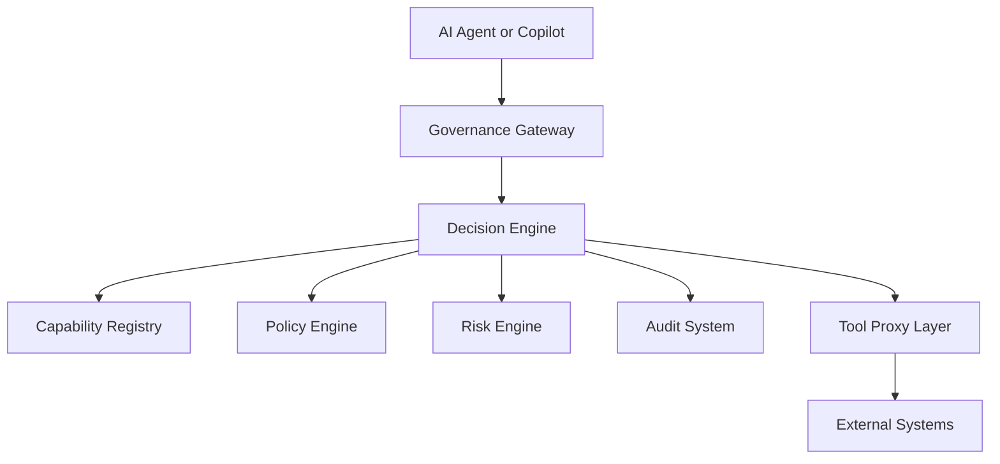
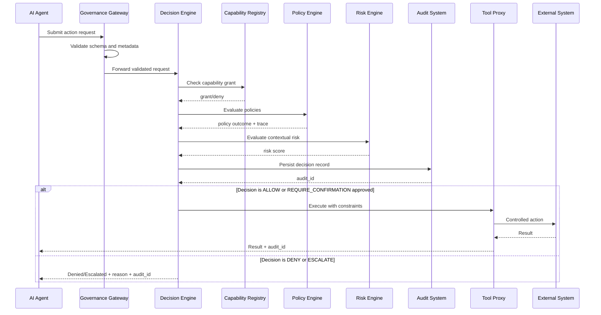

# RFC-0001: AEGIS™ Governance Architecture

**RFC:** RFC-0001
**Status:** Draft  
**Version:** 0.2  
**Created:** 2026-03-05  
**Updated:** 2026-03-06  
**Author:** AEGIS™ Initiative, Finnoybu IP LLC  
**Repository:** aegis-governance  
**Target milestone:** v1.0  
**Supersedes:** None  
**Superseded by:** None

---

## Summary

This RFC defines the reference architecture for AEGIS™ (Architectural Enforcement and Governance of Intelligent Systems). AEGIS introduces a deterministic governance control plane between AI-generated intent and infrastructure execution, ensuring no action executes without explicit evaluation against capability, policy, authority, and risk constraints.

---

## Motivation

Model alignment and content moderation influence outputs but do not guarantee control over operational side effects. When AI systems can take real actions — executing shell commands, modifying infrastructure, sending messages, querying data — policy documents and alignment techniques are insufficient. They describe what should happen. They do not prevent what should not.

AEGIS addresses this gap by enforcing complete mediation at the execution boundary:[^1] every action is evaluated before it reaches external systems, and every decision is recorded immutably.

---

## Guide-Level Explanation

Think of AEGIS as a security guard stationed between an AI agent and everything the agent can touch. When an AI wants to take an action, it submits a proposal. The security guard checks three things: is this agent allowed to do this, does it need human approval, and could this cause irreversible harm? If any check fails, the action never executes.

The guard also keeps a notebook. Every proposal, every decision, every reason — written down in a form that cannot be altered after the fact. If something goes wrong, the notebook is the authoritative record.

---

## Reference-Level Explanation

### 1. Architectural Principles

1. **Deterministic Governance:** same inputs and policy version produce same outcome.
2. **Capability-First Authorization:** every action maps to a predefined capability.
3. **Explicit Authority Attribution:** every request is bound to an authenticated actor.
4. **Default Deny:** absence of explicit authorization yields denial.[^2]
5. **Complete Auditability:** every decision is recorded and replay-verifiable.[^1]
6. **Fail-Closed Safety:** subsystem uncertainty cannot result in implicit allow.[^2]

### 2. System Context

### 3. Component Responsibilities

**Governance Gateway:** validate request schema and semantic constraints; validate actor identity binding; reject malformed requests; route valid requests to Decision Engine.

**Decision Engine:** perform capability check; evaluate policy precedence; evaluate contextual risk thresholds; produce one deterministic outcome (ALLOW, DENY, ESCALATE, REQUIRE_CONFIRMATION).

**Capability Registry:** maintain canonical capability definitions and actor-capability grants; support revocation and expiration semantics.

**Policy Engine:** evaluate policy conditions against request context; apply deterministic precedence rules; emit policy trace for auditability.

**Tool Proxy Layer:** execute only authorized decisions; enforce runtime constraints; prevent direct infrastructure bypass; record execution telemetry.

**Audit System:** append immutable decision records; support retrieval by request/actor/session; provide evidence for replay and compliance.

### 4. Request Lifecycle Sequence

### 5. Security Properties and Guarantees

| Guarantee | Description |
|---|---|
| Capability Isolation | No request executes unless actor capability grant covers action and target |
| Attribution | Every decision includes actor, request ID, and timestamp |
| Non-Bypass | External interfaces are only reachable through Tool Proxy under valid governance decision |
| Audit Integrity | Every evaluated request produces an immutable audit record regardless of outcome |
| Determinism | Policy and risk evaluation are deterministic given identical inputs and versions |

### 6. Failure Mode Analysis

| Failure Mode | Expected Behavior | Security Posture |
|---|---|---|
| Malformed request | Reject at Gateway | Fail closed |
| Capability registry unavailable | Deny/Escalate | Fail closed |
| Policy engine exception | Escalate or Deny | Fail closed |
| Audit persistence failure | Block execution for high-risk ops | Fail closed |
| Tool proxy unavailable | Deny execution path | Fail closed |
| External system timeout | Return controlled failure | No bypass |

---

## Drawbacks

- Adds latency to every AI action. The governance evaluation path introduces overhead. [RFC-0002](./RFC-0002-Governance-Runtime.md) specifies SLO targets to bound this.
- Requires capability definitions to exist before agents can operate. Cold-start and onboarding complexity is non-trivial.
- Default-deny posture will produce friction during initial deployment until registries are tuned to the operational environment.
- Audit log growth is unbounded over time and requires operational management.

---

## Alternatives Considered

**Model-level alignment only:** Relies on the model to self-enforce constraints. Insufficient because model behavior is non-deterministic and cannot provide audit evidence of what was allowed or denied.

**Network-level controls only:** Firewalls and API gateways can restrict what systems an agent can reach but cannot evaluate the semantic intent of a request before it is made.

**Human-in-the-loop for all actions:** Provides strong safety guarantees but eliminates the operational value of AI agents at scale. AEGIS reserves human escalation for genuinely ambiguous or high-risk decisions.

**Policy-as-code without runtime enforcement:** Tools like OPA[^14] can evaluate policy but require integration with an execution boundary. AEGIS provides that boundary as a first-class architectural component.

---

## Compatibility

This is the foundational architecture RFC. All other RFCs are downstream of it. No prior AEGIS deployments exist at the time of this draft.

---

## Implementation Notes

[RFC-0002](./RFC-0002-Governance-Runtime.md) specifies the runtime API. [RFC-0003](./RFC-0003-Capability-Registry.md) specifies the capability registry and policy language. Implementers should read in order: RFC-0001, RFC-0002, RFC-0003, [RFC-0004](./RFC-0004-Governance-Event-Model.md).

---

## Open Questions

- [ ] Should the Risk Engine be a separate RFC or remain within RFC-0001?
- [ ] Should AEGIS define a formal conformance test suite for architecture compliance?

---

## Success Criteria

- A compliant runtime can be built from this RFC and RFC-0002 alone
- Every action that reaches an external system can be traced to an audit record
- No action executes when the governance path is unavailable

---

## References

[^1]: J. P. Anderson, "Computer Security Technology Planning Study," Deputy for Command and Management Systems, HQ Electronic Systems Division (AFSC), Hanscom Field, Bedford, MA, Tech. Rep. ESD-TR-73-51, Vol. II, Oct. 1972. See [REFERENCES.md](../REFERENCES.md).

[^2]: F. B. Schneider, "Enforceable Security Policies," *ACM Transactions on Information and System Security*, vol. 3, no. 1, pp. 30–50, Feb. 2000, doi: 10.1145/353323.353382. See [REFERENCES.md](../REFERENCES.md).

[^14]: Open Policy Agent, v0.61, Cloud Native Computing Foundation, 2024. [Online]. Available: <https://www.openpolicyagent.org>. See [REFERENCES.md](../REFERENCES.md).

---

*AEGIS™* | *"Capability without constraint is not intelligence"™*  
*AEGIS Initiative — Finnoybu IP LLC*
