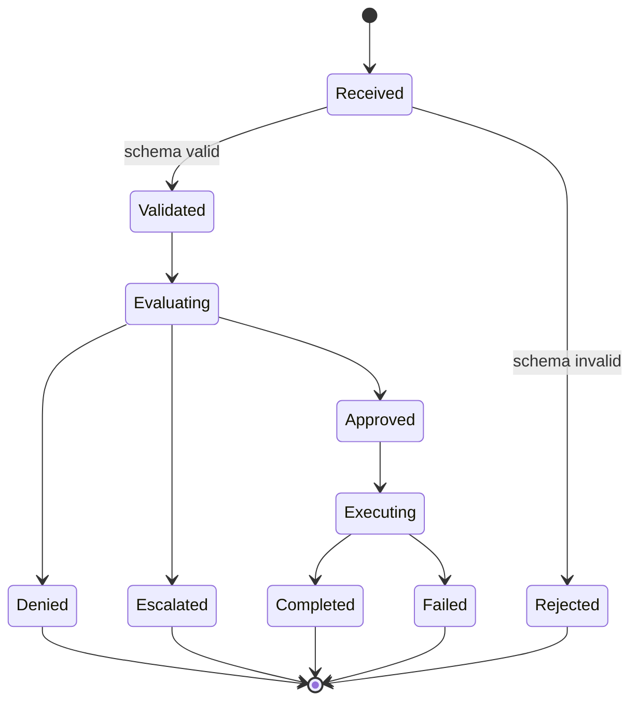
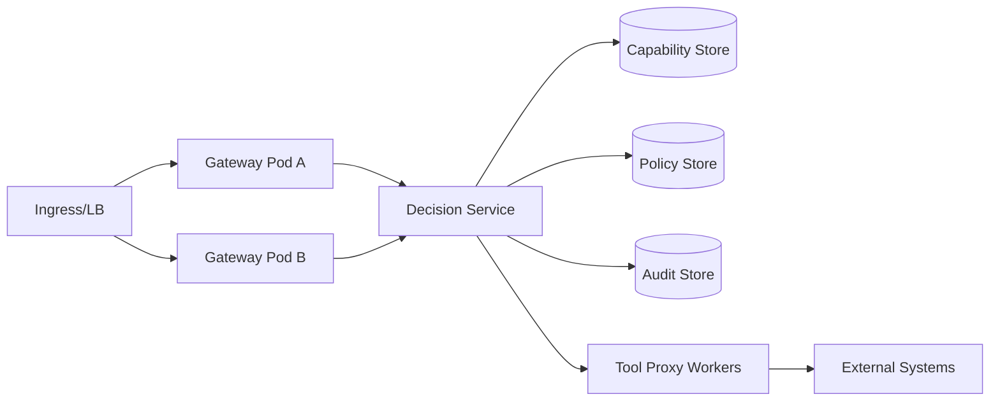

# RFC-0002: AEGIS™ Governance Runtime Specification

**RFC:** RFC-0002
**Status:** Draft  
**Version:** 0.2  
**Created:** 2026-03-05  
**Updated:** 2026-03-06  
**Author:** AEGIS™ Initiative, Finnoybu IP LLC  
**Repository:** aegis-governance  
**Target milestone:** v1.0  
**Supersedes:** None  
**Superseded by:** None  

---

## Summary

This RFC specifies the runtime APIs, state model, error behavior, deployment topology, and performance expectations for the AEGIS™ Governance Runtime: the component responsible for accepting action proposals, evaluating them against governance controls, and enforcing decisions at the execution boundary.

---

## Motivation

RFC-0001 defines what the governance architecture must do. This RFC defines how it behaves at runtime. Without a concrete API surface, state model, and error specification, implementations cannot be validated for compliance and behavior under failure conditions cannot be reasoned about.

---

## Guide-Level Explanation

The Governance Runtime is the operational heart of AEGIS. It is the process that receives action proposals from AI agents, runs them through the decision pipeline, and either permits execution, blocks it, or escalates it for human review.

From an operator's perspective: you deploy the runtime alongside your AI systems, configure it with a capability registry and policy set, and it becomes the mandatory checkpoint for all agent actions. Nothing reaches your infrastructure without passing through it.

---

## Reference-Level Explanation

### 1. Runtime Responsibilities

- Accept action proposals from AI agents
- Validate request schema and semantics
- Evaluate capability, policy, and risk controls
- Enforce controlled execution via tool proxy
- Emit immutable audit evidence

### 2. Runtime Architecture

```mermaid
flowchart TD
    A[Agent Client] --> B[Governance Gateway API]
    B --> C[Decision Engine]
    C --> D[Capability Registry]
    C --> E[Policy Engine]
    C --> F[Risk Engine]
    C --> G[Audit System]
    C --> H[Tool Proxy Layer]
    H --> I[External Systems]

  ```

### 3. API Surface

**Submit Action — POST /aegis/actions**

Request:

  ```json
  {
  "request_id": "uuid-v4",
  "actor_id": "agent:soc-001",
  "capability": "telemetry.query",
  "action_type": "tool_call",
  "target": "siem.search",
  "parameters": {
    "query": "failed_login > 10",
    "window": "15m"
  },
  "context": {
    "session_id": "sess-001",
    "environment": "production",
    "trace_id": "trace-abc",
    "timestamp": "2026-03-05T12:00:00Z"
  }
}
```

Response:

```json
{
  "request_id": "uuid-v4",
  "decision": "ALLOW",
  "reason": "Approved by policy soc_query_allow",
  "audit_id": "audit-6f4f",
  "conditions": ["max_results=500", "timeout_ms=10000"],
  "timestamp": "2026-03-05T12:00:00Z"

}
```

**Retrieve Audit Record — GET /aegis/audit/{audit_id}**

Returns immutable decision and evaluation trace.

**Health — GET /healthz | GET /readyz**

Readiness fails if policy, capability, or audit stores are unavailable.

### 4. Error Handling

```json
{
  "error_code": "INVALID_ACTION_TYPE",
  "message": "action_type must be one of [tool_call, file_read, ...]",
  "request_id": "uuid-v4",
  "retryable": false,
  "timestamp": "2026-03-05T12:00:01Z"
}
```

| Code | HTTP | Retryable | Source |
|---|---|---|---|
| INVALID_REQUEST | 400 | No | Gateway validation |
| UNAUTHORIZED_CAPABILITY | 403 | No | Capability check |
| POLICY_EVALUATION_ERROR | 500 | Maybe | Policy engine |
| AUDIT_PERSIST_ERROR | 503 | Yes | Audit system |
| UPSTREAM_TIMEOUT | 504 | Yes | Tool proxy |

### 5. Runtime State Model



### 6. Performance Requirements

| Metric | Target |
|---|---|
| p50 decision latency | <= 20ms |
| p95 decision latency | <= 75ms |
| p99 decision latency | <= 150ms |
| Audit write success | >= 99.99% |
| Single-node throughput | 500 actions/sec |
| Horizontal target | 10k actions/sec |

### 7. Deployment Architecture



Requirements: least-privilege service identities,[^17] mTLS between components, isolated execution network for proxy workers, immutable config snapshots per runtime version.

### 8. Failure Behavior

- Validation failures: reject immediately
- Policy or capability uncertainty: fail closed
- Audit write failure: block high-risk execution, retry with bounded backoff
- Persistent audit outage: deny high-risk requests and alert
- Tool proxy timeout: return controlled error with audit record

---

## Drawbacks

- The runtime is a single mandatory checkpoint and therefore a potential single point of failure. High-availability deployment is required for production use.
- p99 latency target of 150ms may be unacceptable for latency-sensitive real-time applications. Those use cases require careful registry and policy design to minimize evaluation overhead.
- Stateless gateway design requires that all governance state live in external stores, adding operational complexity.

---

## Alternatives Considered

**Inline evaluation in the agent process:** Eliminates network overhead but allows the agent to bypass governance by modifying its own evaluation logic. Violates the non-bypass guarantee.

**Asynchronous post-execution audit:** Reduces latency but provides no enforcement. Governance that operates after execution is documentation, not control.

**Single-tier runtime without proxy workers:** Simpler to deploy but conflates the governance decision path with the execution path, complicating isolation guarantees.

---

## Compatibility

Downstream of RFC-0001. No breaking changes to RFC-0001 architecture. All RFC-0001 security guarantees are preserved by this specification.

---

## Implementation Notes

Implementers should begin with the API surface and state model. The aegis-runtime repository provides a minimal Python reference implementation. Performance targets are aspirational for v0.x and binding at v1.0.

---

## Open Questions

- [ ] Should the runtime expose a streaming API for long-running agent sessions?
- [ ] Should audit record retrieval support batch queries?

---

## Success Criteria

- A compliant implementation satisfies all API contracts defined in Section 3
- All failure modes in Section 8 produce the specified behavior under test
- p99 latency target is met under the throughput targets in Section 6

---

## References

- RFC-0001 — AEGIS Architecture
- RFC-0003 — Capability Registry and Policy Language
- RFC-0004 — Governance Event Model
- AGP-1 Protocol — `aegis-core/protocol/AEGIS_AGP1_INDEX.md`
- aegis-runtime — `github.com/finnoybu/aegis-runtime`

[^17]: National Institute of Standards and Technology, *Zero Trust Architecture*, NIST SP 800-207, Aug. 2020. [Online]. Available: https://doi.org/10.6028/NIST.SP.800-207. See [REFERENCES.md](../REFERENCES.md).

---

*"Capability without constraint is not intelligence™"*  
*Finnoybu IP LLC — AEGIS™ Initiative*
